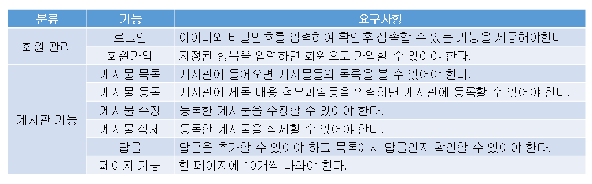
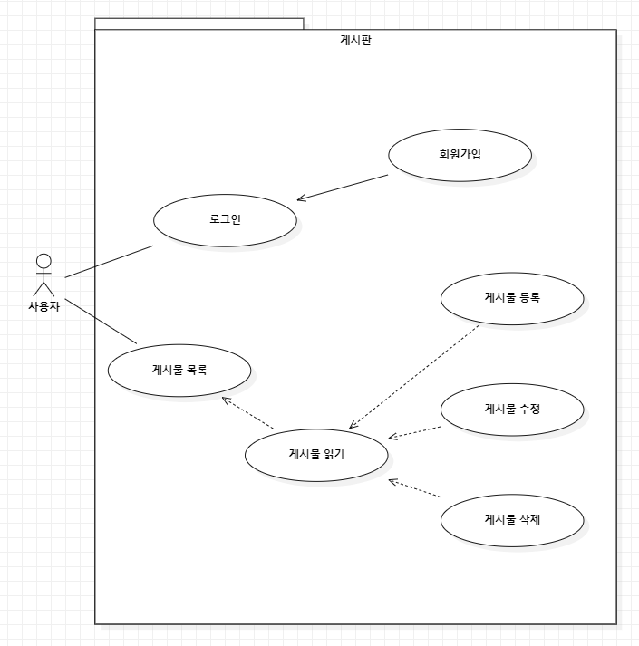
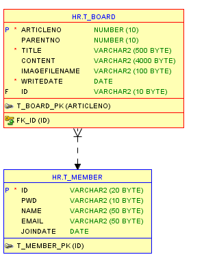
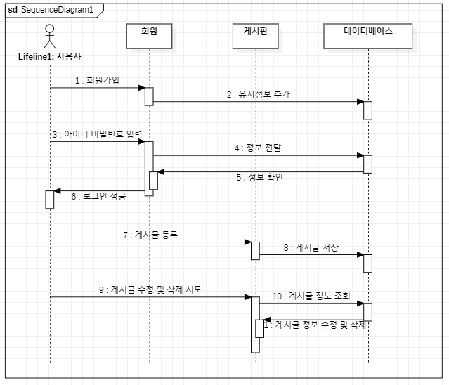
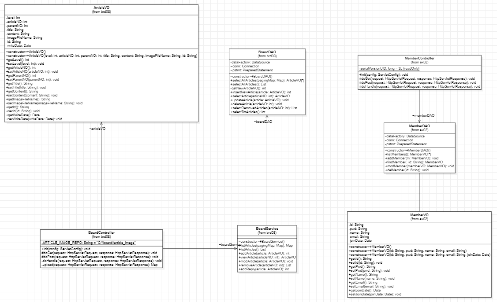
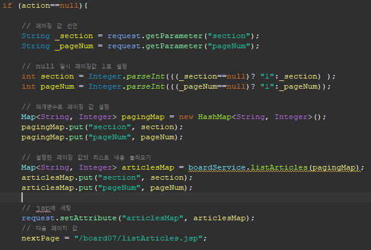
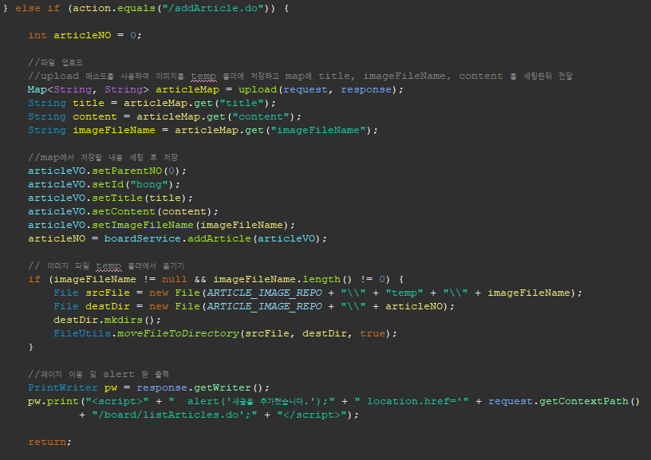
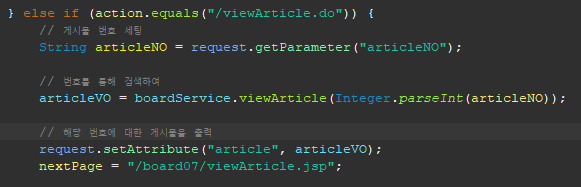
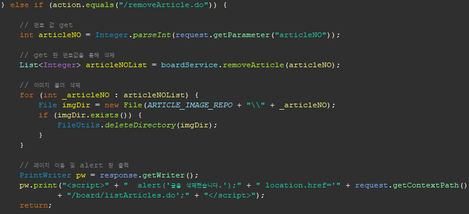

# MVC2_boards
***
## 프로그램 개요
MVC 패턴을 사용하여 ..

***
### 사용 언어
1. 언어 및 프레임워크 : JDK-11, JSP, Servlet, CSS
2. 개발툴 : 이클립스 JEE
3. DB : Oracle, SqlDeveloper

***
### 요구사항 명세 

***
### 다이어그램 
1. 유스케이스 다이어그렘 

2. ER 다이어그렘 

3. 시퀀스 다이어그렘 

4. 클래스 다이어그렘 

***
### 핵심 소스코드
1. list 불러오기  

2. 게시물 등록  

3. 게시물 읽기  

4. 게시물 삭제  

### 구현된 기능
*** 
1. CRUD 기능
2. 페이징 기능
3. 댓글 쓰기

### 해결해야 할 문제
***
1. 수정 시 첨부파일을 첨부하지 않으면 수정 불가
2. 게시물이 정확히 10개 단위일때 페이지가 생기는데 해당 페이지를 누르면 공백 출력